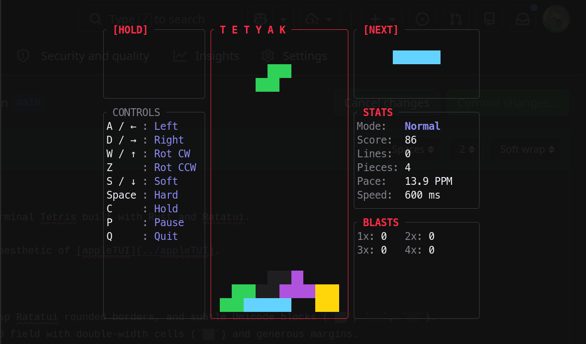

# tetyak

A minimal, taste-first terminal Tetris built with Rust and Ratatui, inspired by the visual design of [appleTUI](../appleTUI).



---

## Controls

| Key | Action |
|:---|:---|
| `A` / `←` | Move Left |
| `D` / `→` | Move Right |
| `W` / `↑` | Rotate Clockwise |
| `Z` | Rotate Counter-Clockwise |
| `S` / `↓` | Soft Drop |
| `Space` | Hard Drop (Instant lock) |
| `C` / `Shift` | Hold Piece |
| `P` | Pause / Resume |
| `T` | Cycle Theme (Apple Dark / Catppuccin / Tokyo Night) |
| `R` | Restart (on Game Over) |
| `Q` / `Esc` | Quit |

---

## Installation & Running

```bash
make install
```

Launch from anywhere via:

```bash
tetyak
# or
tetris
```

---

## License

MIT
